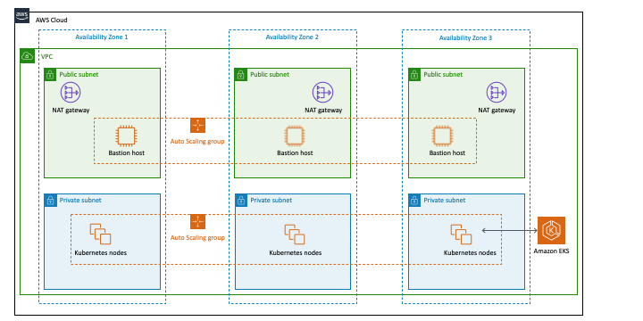

= Amazon EKS on AWS

[#architecture1]

The architecture comprises the following Amazon EKS environment in the AWS Cloud:

* A highly available architecture that spans three Availability Zones.
* A VPC configured with public and private subnets, according to AWS best practices, to provide a virtual network on AWS.
* In the public subnets, managed NAT gateways to allow outbound internet access for resources in the private subnets.
* In one public subnet, a Linux bastion host in an Auto Scaling group to allow inbound Secure Shell (SSH) access to Amazon Elastic Compute Cloud (Amazon EC2) instances in private subnets. The bastion host is also configured with the Kubernetes `kubectl` command line interface (CLI) for managing the Kubernetes cluster.
* An Amazon EKS cluster, which creates the Kubernetes control plane.
* In the private subnets, a group of Kubernetes nodes.

NOTE: If you deploy Amazon EKS into an existing VPC, ensure that your VPC has private subnets in different Availability Zones for the workload instances. The subnets require egress internet access using a NAT gateway or an HTTP proxy. If you want to use the Kubernetes integration with Elastic Load Balancing, you must tag each private subnet with `kubernetes.io/role/internal-elb=true` and each public subnet with `kubernetes.io/role/elb=true`.

== Scaling the Kubernetes cluster

=== Cluster autoscaler

https://github.com/kubernetes/autoscaler/tree/master/cluster-autoscaler[Cluster autoscaler^] automatically adjusts the
size of the Kubernetes cluster when there are insufficient resources or nodes.

=== Managed node group

With Amazon EKS–managed node groups, provisioning and lifecycle management of the nodes is automated. All nodes get
provisioned as part of an Auto Scaling group, which means we cannot use the *Cluster autoscaler* option. Nodes are created using the latest Amazon EKS–optimized Amazon Linux 2 AMI.

== Security

Amazon EKS uses AWS IAM to authenticate your Kubernetes cluster, but it still relies on native Kubernetes RBAC. This means that IAM is used only for valid entities. All permissions for interacting with your Amazon EKS cluster’s Kubernetes API are
managed by the native Kubernetes RBAC system. It's recommended to grant least-privilege access via Kubernetes RBAC.
